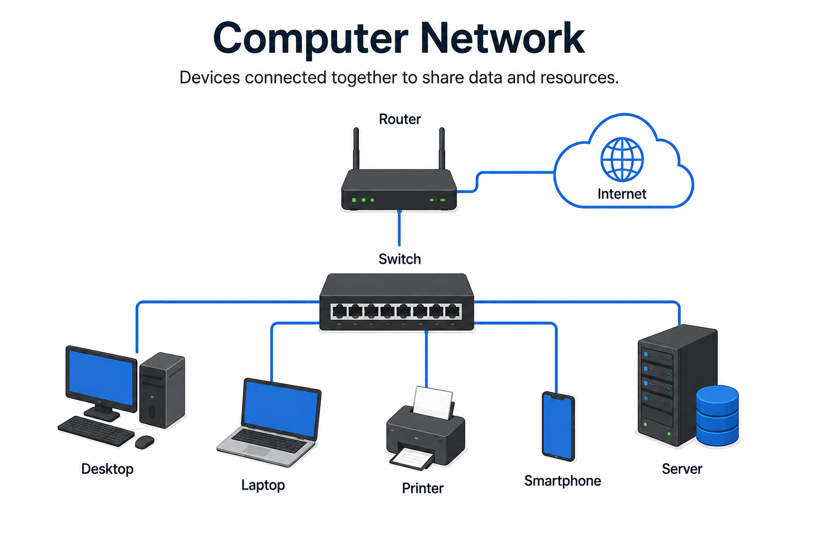
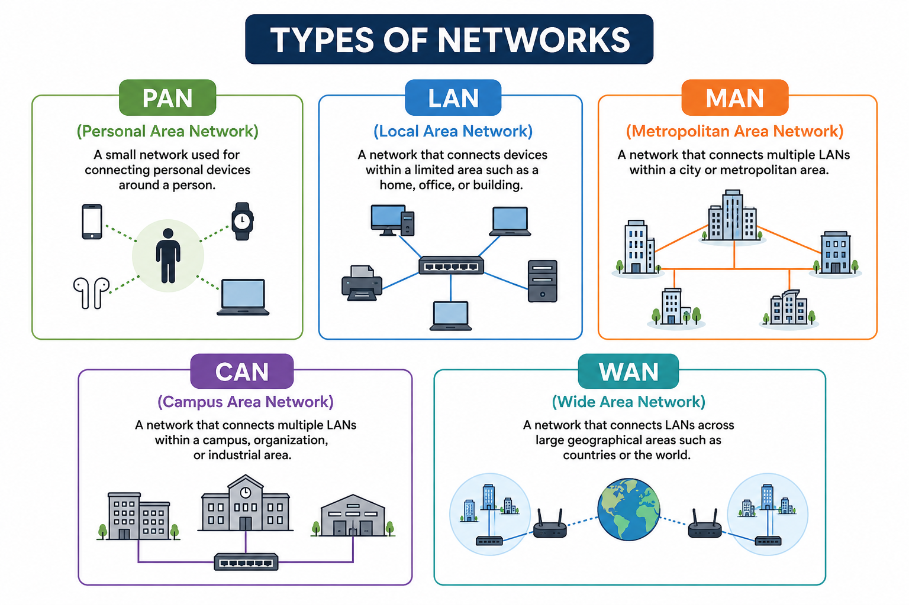

## 🌐 Networking Fundamentals

---
# 📑 Contents
- What is a Computer Network?
- Types of Networks
- Quick Recap  
---

# 🌐 Networking Fundamentals — Introduction & Network Types
> 📘 Part of my hands-on Networking & Cybersecurity learning journey, where I simplify technical concepts into concise, visual notes.

---

## 🤝 Let's Connect

---

## 🏛️ 1. What is a Computer Network?

A **computer network** is a collection of connected devices that communicate and share data, resources, and services.

💡 **Did You Know?**

Modern networking began with **ARPANET** in 1969, introducing packet switching—the technology that laid the foundation for today's Internet.

  

---

## 🌍 Types of Networks

Networks are classified by the geographical area they cover.

  

| Network | Coverage |
|---------|----------|
| 📱 PAN | Personal devices |
| 🏠 LAN | Home or office |
| 🏙️ MAN | City |
| 🌎 WAN | Country or worldwide |

---

## ✅ Quick Recap

- 🔗 A network connects devices.
- 📡 Networks enable communication and resource sharing.
- 📱 PAN → 🏠 LAN → 🏙️ MAN → 🌎 WAN (smallest to largest coverage).
- 
---

*If you find this learning series helpful, feel free to star ⭐ the repository to follow along!*

---

